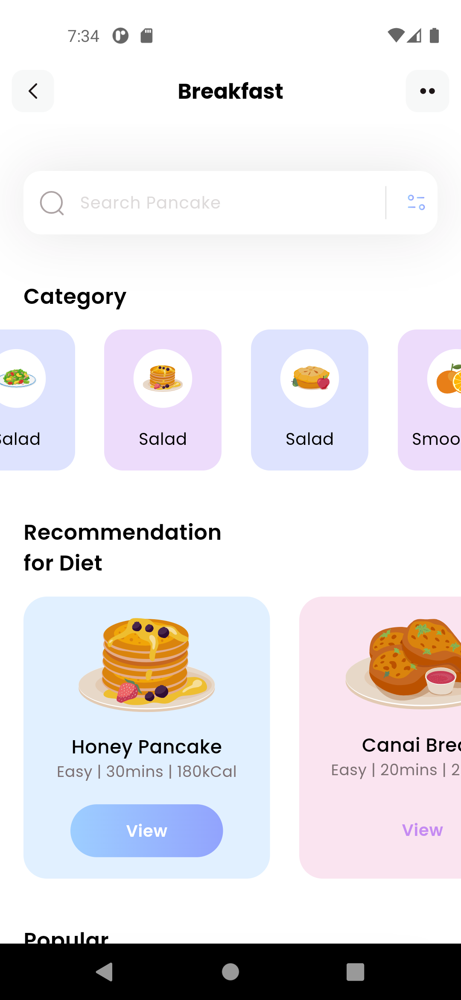
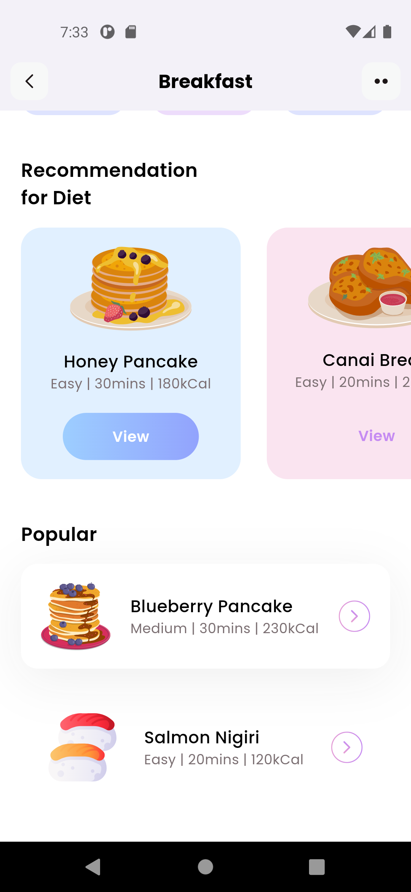

# FitnessDiet (Flutter Beginner Project)

## 📌 Overview
Ini adalah proyek pertama saya dalam belajar Flutter. Proyek ini saya kerjakan dengan mengikuti tutorial dari salah satu video di YouTube untuk memahami dasar-dasar pengembangan aplikasi menggunakan Flutter. 

Proyek ini dibuat sebagai langkah awal dalam eksplorasi framework Flutter untuk membangun aplikasi mobile yang sederhana.

## 🚀 Teknologi yang Digunakan
- Flutter
- Dart

## 📷 Preview Aplikasi




## 🎯 Tujuan Proyek
- Mempelajari dasar-dasar Flutter
- Memahami struktur proyek Flutter
- Mengimplementasikan state management sederhana
- Mencoba menjalankan aplikasi di emulator dan perangkat fisik

## 🔧 Cara Menjalankan
1. Clone repository ini:
   ```bash
   git clone https://github.com/rivandimizwar/FitnessDiet.git
   ```
2. Masuk ke direktori proyek:
   ```bash
   cd FitnessDiet
   ```
3. Jalankan perintah berikut untuk menginstall dependency:
   ```bash
   flutter pub get
   ```
4. Jalankan aplikasi:
   ```bash
   flutter run
   ```

## 📌 Catatan
- Proyek ini hanya untuk keperluan belajar dan eksplorasi awal.
- Jika ingin berkontribusi atau memberikan saran, silakan buat issue atau pull request.

---
📌 **Author**: Rivandi Mizwar
📅 **Tanggal Mulai**: Februari 2025
